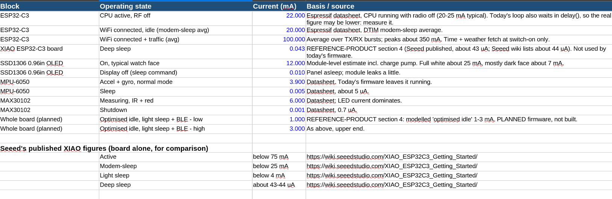
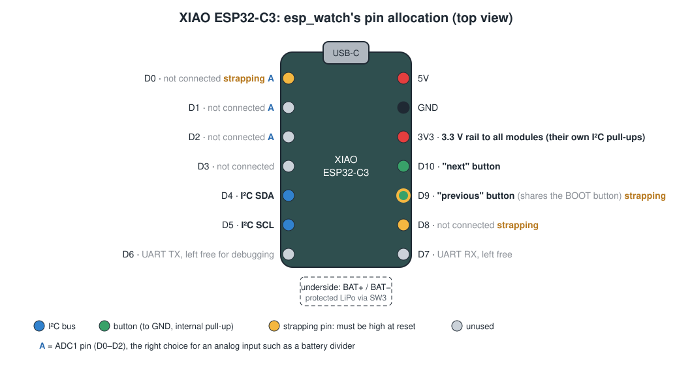

# B3 — Electrical Architecture: MCU, Power, Buses and Pins
## The Big Electrical Decisions, Made Before Any Part Is Chosen

**Course:** C3 — From Problem Statement to Manufacturable Design
**Module:** 2 — Sensing and Hardware Architecture
**Time:** ~2 hours · **You will produce:** a power tree, a current budget spreadsheet and a pin allocation map

---

### Four Decisions That Are Expensive to Change Later

Your block diagram from B2 still has gaps marked "TBD". Which microcontroller? Where does power come from, and how does it reach each part? How big are the pull-up resistors? Which pin does each signal use?

Each choice locks in others. Too few pins, and the last sensor has nowhere to go. A switch in the wrong place, and the battery cannot charge. An interrupt on a strapping pin, and the board may not start. All are painful to fix once the board exists.

### What You Will Be Able to Do After This Reading

- **Select** a microcontroller class from your requirements: memory, pins, radio, and module versus bare chip.
- **Draw** a power tree from charger to every load, and **identify** what each switch and regulator does.
- **Calculate** a current budget per operating mode, and show how duty cycling changes battery life.
- **Size** I²C pull-up resistors from the bus specification, including the effect of several modules' pull-ups in parallel.
- **Produce** a pin allocation map that avoids boot pins and puts analog signals on suitable pins.

### What Part 1 Already Covered

Part 1 covered dividers, GPIO, ADC and I²C. What is new here is making these choices for a whole board before the schematic starts.

---

# Part 1 — Choosing the Microcontroller Class

## What Do You Actually Need?

Choose a **class** of microcontroller first, and a specific part later. The class is defined by four questions, and your spec and interface table already contain the answers.

| Question | Where the answer comes from |
|---|---|
| How much program memory (flash) and working memory (RAM)? | Firmware size, display buffer, data you store (A1's data estimate) |
| How many pins, and of what kinds? | Your B2 interface table: count digital, analog and bus pins |
| Does it need a radio, and which? | Your A1 connection choice |
| Module or bare chip? | Your team's ability to design RF circuits, and your certification budget |

Count pins from the interface table, not from memory. Add about 20% spare, because designs grow and a debug pin is priceless later.

## Module or Bare Chip?

A **bare chip** is the microcontroller alone. A **module** carries the chip plus its crystal, flash, regulator and antenna or antenna connector. For a first product, choose a module. A device that transmits radio needs government approval before it can be sold in India [5], and a pre-certified module saves you most of that work. B4 compares the two in full.: a crystal, flash memory, a regulator, and usually an antenna or antenna connector.

The difference shows up clearly in schematic symbols. The bare ESP32-C3 chip has pins for an external crystal, external SPI flash and an antenna input (`LNA_IN`). A module has none of these on its edge, because they are already inside.

| | Module | Bare chip |
|---|---|---|
| Design effort | Low: power, ground and signals | High: crystal, flash, RF matching and antenna layout |
| Radio certification | Module maker has often certified the module | You certify your own design |
| Unit cost at volume | Higher | Lower |
| Board area and height | More | Less |
| Hand soldering | Often possible | Usually needs reflow |

The certification row settles it for a first product: a device that transmits radio needs government approval before it can be sold in India [5], and a pre-certified module saves you most of that work.

<!-- REFPRODUCT:START -->
esp_watch uses the **Seeed Studio XIAO ESP32-C3**: a small module-style board with a 32-bit RISC-V processor, WiFi and Bluetooth, 400 KB of SRAM and 4 MB of flash [1]. It exposes 11 pins labelled D0 to D10, a USB-C port, battery pads and a U.FL connector for an external antenna. esp_watch's interface table needs only four signal pins: two for I²C and two buttons. Both sensors are polled over I²C, so their interrupt pins are not wired, and the watch does not measure its battery. Four of eleven leaves seven spare, but several come with restrictions, as Part 4 shows.
<!-- REFPRODUCT:END -->

The XIAO ESP32-C3 itself carries an FCC certification (FCC ID Z4T-XIAOESP32C3), and Seeed publishes its CE and other certificates [6]. That is the work a module saves you.

---

# Part 2 — Power Architecture

## The Power Tree

A **power tree** shows every source of energy, every conversion and every switch, down to every load. Draw it before choosing any power part.

<!-- REFPRODUCT:START -->
Here is esp_watch's power tree:

```text
USB-C 5 V (phone charger)
   │
   ▼
┌───────────────────────────────── XIAO ESP32-C3 ──────────────────────────────┐
│  onboard charger ◄──────────────── BAT+ / BAT− pads                          │
│        │                                  ▲                                  │
│        ▼                                  │                                  │
│  3.3 V regulator ─────────────────────────┼──────► 3V3 pin                   │
└───────────────────────────────────────────┼──────────┬───────────────────────┘
                                            │          │ 3.3 V rail
                              slide switch (SW3)   ├──► ESP32-C3 (internal)
                                            │          ├──► SSD1306 display
                         protected LiPo cell 3.7 V     ├──► MPU-6050 motion sensor
                                                       └──► MAX30102 heart rate
                                                            (each module carries its own I²C pull-ups)
```

Three things in this tree are design decisions worth examining.

**The charger and regulator are on the XIAO.** No external charger was needed. The BAT pads accept a 3.7 V lithium cell only, never 5 V, and the onboard regulator holds 3.3 V as the cell voltage falls.

**The slide switch sits between the cell and the BAT pads.** (On the built board its pads are in place; the switch itself is still to be fitted.) When the switch is off, the cell is disconnected from everything, including the charger. So plugging in USB with the switch off runs the watch from USB but **cannot charge the battery**. That may be acceptable, but it must be a known behaviour, written in the user instructions, not a surprise.

**There is no battery measurement.** The XIAO handles charging, and the cell is a **protected** LiPo with its own cut-off circuit, so esp_watch does not add a battery-sense divider. The cost of that choice: the firmware cannot show a battery level or warn before the cell cuts off.
<!-- REFPRODUCT:END -->

<!-- FACT:VERIFY esp_watch — REFERENCE-PRODUCT.md §4 states the XIAO regulator can supply up to 700 mA; Seeed's wiki lists "Max 3.3V Output Current: 500mA" at a BAT input of 3.8 V. This reading uses the lower, documented figure. -->

Is the regulator big enough? Seeed lists a maximum 3.3 V output current of **500 mA** with the battery input at 3.8 V [1]. The largest modelled load on esp_watch is a WiFi burst averaging about 100 mA. Radio transmissions draw short peaks above their average, so the margin matters, but 500 mA leaves plenty.

## If Your Product Needs a Battery Level: a Divider

esp_watch does without one, but many battery products show a battery level. The XIAO has no pin for measuring its own battery, so you would add one: **example values** are two 1 MΩ resistors in series across the battery, with the midpoint on an ADC pin and a 100 nF capacitor from the midpoint to ground. Seeed's own documentation describes the same approach, halving the battery voltage so the ADC can read it [1].

### Worked Example: Checking the Divider

**Step 1: Will the ADC voltage stay in range?** A fully charged lithium cell is typically about 4.2 V (**assumption**, typical for this chemistry). The divider halves it:

```text
V_adc = 4.2 V × 1 MΩ / (1 MΩ + 1 MΩ) = 2.1 V
```

Seeed notes a nominal full-scale ADC reading of 2,500 mV on this board, varying by about ±10% from chip to chip [1]. The worst case is 2,500 × 0.9 = 2,250 mV, which is still above 2.1 V. It fits.

**Step 2: How much current does it waste?**

```text
I = 3.7 V / (1 MΩ + 1 MΩ) = 1.85 µA
Per day: 1.85 µA × 24 h = 44 µAh = 0.044 mAh
```

Against a daily budget of 40–87 mAh (from A0), this is under 0.1%. Large resistors were the right choice.

**Step 3: Why the capacitor?** Large resistors come with a catch. When the ADC takes a sample, it briefly draws current to charge its own internal sampling capacitor. Through 500 kΩ (the two resistors seen in parallel from the midpoint), that charge arrives too slowly and the reading comes out low. The 100 nF capacitor holds a small reservoir of charge right at the pin, so the ADC samples from the capacitor rather than through the resistors.

**Check.** Because the ADC's full scale varies ±10% between chips, calibrate the firmware against a known voltage rather than trusting the nominal scale.

## The Current Budget

A **current budget** lists every operating mode, the current in each, and how long the device spends there. You met a simple version in A0. Here it becomes a spreadsheet you maintain for the rest of the course.

<!-- REFPRODUCT:START -->
esp_watch's figures come from a power model, **not from measurement**. No current was ever measured on the reference watch.

| Mode | Current (modelled) | Power at 3.7 V |
|---|---|---|
| Screen on, WiFi connected | ~36 mA | ~135 mW |
| Heart-rate measurement | ~44 mA | ~165 mW |
| WiFi sync burst | ~100 mA average | ~370 mW |
| Optimised idle (light sleep + BLE) | 1–3 mA | 4–10 mW |

Seeed's published figures for the XIAO board alone: active below 75 mA, modem-sleep below 25 mA, light sleep below 4 mA, deep sleep about 44 µA [1].
<!-- FACT:VERIFY REFERENCE-PRODUCT.md §4 gives deep sleep as about 43 µA; this line quotes Seeed's wiki. Author to reconcile. -->
<!-- REFPRODUCT:END -->



### Worked Example: Hours or Days? Duty Cycling the Heart-Rate Sensor

Heart-rate measurement is the largest regular load in esp_watch's model (44 mA). How often you measure decides whether the battery lasts hours or days.

Use esp_watch's modelled figures and its 300 mAh cell, 80% usable, so 240 mAh.

**Case 1: Measure continuously.**

```text
44 mA × 24 h = 1,056 mAh per day
Runtime: 240 mAh ÷ 44 mA = 5.5 hours
```

**Case 2: Measure for 30 s every 10 minutes** (144 times a day). **Assumption:** the screen stays off during these background readings; the wearer still wakes the screen 50 times a day for 30 s.

```text
Heart rate: 144 × 30 s = 4,320 s = 1.2 h   × 44 mA = 52.8 mAh
Screen:      50 × 30 s = 1,500 s = 0.417 h × 36 mA = 15.0 mAh
Sleep:      24 − 1.2 − 0.417     = 22.38 h × 1 mA  = 22.4 mAh  (best)
                                            × 3 mA  = 67.1 mAh  (worst)
Per day:                                    90.2 mAh (best)  134.9 mAh (worst)
Runtime:    240 ÷ 90.2 = 2.7 days          240 ÷ 134.9 = 1.8 days
```

**Case 3: Measure only when asked**, 5 times a day, which is A0's usage pattern UP-1: **2.7 to 6.0 days**.

**Check.** The same hardware lasts about 5 hours, about 2 days, or up to about 6 days, depending only on how often the firmware turns on the sensor. The electrical architecture sets the ceiling; the firmware decides how close you get to it. That is why the current budget must be written per mode, not as one number.

Start the spreadsheet for activity 3 from this template. Give a source for every figure.
> 1. **Predict.** Which mode will dominate your daily total?
> 2. **Do.** Fill one row per mode from your A2 state diagram. Use datasheet or module figures, and write where each number came from in the *Source* column. Add a sleep row for the rest of the day. Sum mAh per day, then divide your usable battery capacity by it.
> 3. **Explain.** Was your prediction right? Does your runtime meet your A0 battery requirement?
>
> **Extra challenge:** Add a column for a worst case that uses the highest datasheet figure for each mode. Does the requirement still hold?

A starting template you can paste into any spreadsheet:

```text
Mode,Current_mA,Times_per_day,Duration_s,Hours_per_day,mAh_per_day,Source
Screen on,36,50,30,=C2*D2/3600,=B2*E2,modelled (esp_watch)
Heart rate,44,5,30,=C3*D3/3600,=B3*E3,modelled (esp_watch)
Sleep,2,1,,=24-E2-E3,=B4*E4,modelled mid-range
Total,,,,,=SUM(F2:F4),
Usable capacity mAh,240,,,,,300 mAh x 0.8
Runtime days,=B6/F5,,,,,
```

## Decoupling and Protection

Two more items belong in the power architecture.

**Decoupling capacitors** sit right next to each chip's supply pins and supply the sudden bursts of current a chip draws when it switches. A common starting point is a 100 nF capacitor at every supply pin, plus a larger bulk capacitor where power enters the board. With modules, the question changes: most breakout modules already carry their own decoupling, so your job is to check each module's schematic rather than add capacitors by habit.

<!-- REFPRODUCT:START -->
esp_watch's carrier board adds **no** decoupling capacitors of its own. Every part on it is a module, and each module carries its own capacitors next to its chip.
<!-- REFPRODUCT:END -->

**Protection** means deciding what happens when something goes wrong electrically:

| Risk | Typical protection | Where it can live |
|---|---|---|
| Battery drained too far | Cut off below a safe voltage | Cell's own protection circuit, charger, or firmware using the battery-sense pin |
| Battery connected backwards | Keyed connector, or a protection device | Connector choice, carrier board |
| USB and battery both connected | Power-path switching | Charger or module |
| Static discharge through buttons or port | ESD protection parts | Carrier board |

<!-- REFPRODUCT:START -->
Seeed states that the XIAO ESP32-C3 can stay connected to USB while running from the battery, because of a protection chip on the board. With no battery measurement, esp_watch relies on the protected cell's own cut-off: when the cell is flat, the watch simply stops, which is the hard stop recorded in A2's failure table.
<!-- REFPRODUCT:END -->

---

# Part 3 — Communication Buses

## Bus Voltage and Addresses

Every device on a bus must agree on two things: the **voltage** that means HIGH, and a unique **address**. You recorded both in B2's interface table. Now make sure they are consistent:

- **Voltage:** every device on the bus should be pulled up to the same voltage, and every device must tolerate it. A 5 V module on a 3.3 V bus needs a **level shifter**. A module whose bus lines sit at 1.8 V internally will drag the whole bus down. esp_watch's first heart-rate module, a green one, clamped its bus to 1.82 V, so the build uses the black module instead.
- **Addresses:** list every device's address and how it is set. Where an address depends on a pin, that pin must be tied to a defined level, never left floating.

<!-- REFPRODUCT:START -->
esp_watch's three addresses (0x3C, 0x57, and 0x68 with AD0 tied to ground) do not clash. B1 tells the address and clone-sensor story. the motion sensor's identity register reads 0x70 rather than the genuine part's 0x68, which marks it as a **clone** chip. It works correctly, but it is a reminder that cheap modules may not contain exactly what the label says.
<!-- REFPRODUCT:END -->

## Sizing Pull-up Resistors

I²C lines are **open-drain**: devices can only pull a line LOW. A **pull-up resistor** pulls it back HIGH. Its value is a trade-off:

- **Too large**, and the line rises too slowly, because the resistor must charge the bus's capacitance. Slow edges limit the bus speed.
- **Too small**, and a device pulling the line LOW must sink too much current, and may not pull it low enough to count as a clear LOW.

The I²C specification turns both limits into formulas [2]:

```text
R_min = (V_DD − V_OL) / I_OL        V_OL = 0.4 V at I_OL = 3 mA
R_max = t_r / (0.8473 × C_b)        t_r max = 1000 ns (100 kHz), 300 ns (400 kHz)
                                    C_b = total capacitance of the bus line
```

### Worked Example: How Many Pull-ups Is Too Many?

**Assumption:** the bus capacitance is 50 pF. The real value depends on every device pin and every track, and you will estimate it more carefully during layout.

**Step 1: The smallest allowed resistor at 3.3 V.**

```text
R_min = (3.3 − 0.4) / 0.003 = 967 Ω
```

**Step 2: The largest allowed resistor.**

```text
At 400 kHz: R_max = 300 ns / (0.8473 × 50 pF) = 7,081 Ω
At 100 kHz: R_max = 1000 ns / (0.8473 × 50 pF) = 23,604 Ω
```

So at 400 kHz, any value between about 1 kΩ and 7 kΩ is inside the specification. 4.7 kΩ sits comfortably in the middle.

**Step 3: What happens when modules bring their own?** Many breakout modules fit their own pull-ups. Three modules, each with a 4.7 kΩ pair, put three resistors in parallel on each line:

```text
R_parallel = 4.7 kΩ / 3 = 1.57 kΩ
Current when a device pulls LOW: 3.3 V / 1.57 kΩ = 2.1 mA
```

Add the carrier board's own pair and it becomes 4.7 / 4 = 1.18 kΩ, needing 2.8 mA. That is within a hair of the 3 mA every device must be able to sink. One more module, or one module with 2.2 kΩ pull-ups, and the bus is outside the specification.

**Check.** Three pairs (1.57 kΩ) are legal on paper, but each device must now sink three times the current of a single pair (2.1 mA against 0.7 mA).

<!-- REFPRODUCT:START -->
esp_watch shows both sides of this. Its carrier board has **no pull-up resistors**: the three modules' own pairs stay fitted, about 1.5 kΩ in parallel. On the breadboard, with the green MAX30102 module, the bus was unreliable at 400 kHz, and the author noted the parallel pairs as one possible contributor. With the black module, the same three pairs passed at both 100 and 400 kHz. Three pairs worked; a fourth module, or a carrier pair added "to be safe", would take the bus to 1.18 kΩ and the edge of the specification.
<!-- REFPRODUCT:END -->

The rule to take away: **count the pull-ups on every bus before you add any.** Check each module's schematic for its own pair. If the modules already give a total inside the specification, add none, as esp_watch does. If they push it below about 1 kΩ, remove some, or fit one pair on your board instead.

---

# Part 4 — Pin Allocation

## Not All Pins Are Equal

A **pin allocation map** assigns every signal to a specific pin. It is not a matter of taking the next free number. Some pins have special jobs that can trap you:

- **Strapping pins** are read at the moment the chip starts up, to decide *how* it starts, for example normal operation or waiting for new firmware. Anything connected to them must hold the right level at reset.
- **Analog-capable pins** are the only ones that can read a voltage with the ADC.
- **Pins shared with a built-in function**, such as the USB serial port or the boot button, may be busy at startup or during programming.

On the ESP32-C3, the strapping pins are **GPIO2, GPIO8 and GPIO9**, which the XIAO brings out as **D0, D8 and D9**. Espressif's datasheet shows that GPIO9 selects between normal start-up and download mode, that GPIO8 must be high for download mode to work, and that GPIO2 is recommended to be pulled high to avoid glitches [3]. Seeed repeats the warning for the XIAO: the wrong level on these pins can stop the board uploading or running its program [1]. The simplest safe rule, and the one esp_watch follows, is to **keep all three high at reset**.

## Worked Example: esp_watch's Pin Map

<!-- REFPRODUCT:START -->
| XIAO pin | Capabilities | esp_watch signal | Why this pin |
|---|---|---|---|
| D0 | ADC1, **strapping** | not connected | Left free, so nothing can pull this strapping pin low at reset |
| D1 | ADC1 | not connected | Free; an ADC1 pin |
| D2 | ADC1 | not connected | Free; an ADC1 pin, so a natural home for a battery divider in a v2 |
| D3 | ADC2 | not connected | Free, with no start-up role |
| D4 | I²C SDA (default) | SDA | XIAO's default I²C pin |
| D5 | I²C SCL (default) | SCL | XIAO's default I²C pin |
| D6 | UART TX | not assigned | Left free |
| D7 | UART RX | not assigned | Left free |
| D8 | **strapping** | not connected | Kept high at reset (required for download mode); nothing attached that could pull it low |
| D9 | **strapping**, boot button | "Previous" button | To ground, internal pull-up. It shares the pin with the XIAO's own BOOT button, so it behaves the same way: unpressed, the watch starts normally; held during reset, it starts in download mode |
| D10 | — | "Next" button | To ground, internal pull-up |
<!-- REFPRODUCT:END -->

The D6 and D7 functions come from Seeed's pinout [1]; esp_watch's recorded pin map does not assign them.

esp_watch leaves D0 and D8 unconnected and puts a button on D9. A button to ground is safe on a strapping pin only if nobody presses it during reset, and D9 already carries the XIAO's BOOT button, so nothing new can go wrong there. If your design uses sensor interrupts, each one's idle level decides where it can go:

- An **active-low, open-drain** interrupt, like the MAX30102's [4], sits high through its pull-up and only pulls low when it has data. On a strapping pin such as D0, that pull-up would also hold the pin high at reset, which is safe.
- An interrupt that **idles low**, like the MPU-6050's, would hold a strapping pin low at reset and could stop the chip starting normally. It must go on a pin with no start-up role, such as D3.

esp_watch's free pins are D0–D3 and D6–D8. D0 and D8 are strapping pins, and D6 and D7 carry the debug UART. That leaves D1, D2 and D3 fully free: room for one more button or a battery divider in a v2.

For analog inputs, such as a battery divider, use ADC1 pins (D0 to D2 on the XIAO). On the ESP32-C3, Espressif no longer supports single ADC2 readings because a hardware erratum makes them unstable [7].



> **Try it: Find the boot trap.** A student assigns: motion-sensor interrupt (idles low) → D9; heart-rate interrupt (open-drain with a 10 kΩ pull-up, idles high) → D3; buttons to ground → D0 and D1.
> 1. **Predict.** Will this board start up reliably?
> 2. **Do.** For each strapping pin, write the level it will sit at during reset with this allocation. Remember a button to ground reads high through its internal pull-up only after the firmware turns that pull-up on.
> 3. **Explain.** Which assignment is the problem, and what is the smallest change that fixes it?

---

# Putting It All Together

## Applying What You Have Learned

**1. Choose your microcontroller class.** Answer the four questions in Part 1, count pins from your interface table plus 20%, and decide module or bare chip with a reason.

**2. Draw your power tree.** From every source to every load, including switches, regulators, the charger and any measurement circuit. For each switch, write what happens when it is off and USB is connected.

**3. Build your current budget spreadsheet.** One row per mode from your A2 state diagram, with the source of every number. Calculate runtime and compare with your A0 requirement. Add a duty-cycling comparison for your most power-hungry sensor.

**4. Size your pull-ups.** Estimate bus capacitance as 10 pF per device plus 10 pF for wiring (**assumption**). Calculate R_min and R_max at your bus speed. List every module's own pull-ups, work out their combined value, and state which pull-ups you keep (and whether your board adds any).

**5. Allocate your pins.** Build a pin map like esp_watch's, with a *Why this pin* column. Mark every strapping pin and state its level at reset.

**Deliverable:** add the power tree, current budget spreadsheet and pin allocation map to your design pack as `B3-electrical-architecture.md` plus your spreadsheet file.

## Self-Check

Open your B3 files and answer each item Y or N.

1. The microcontroller choice states flash, RAM, pin count and radio requirements, each traced to a source. — Y/N
2. The pin count includes at least 20% spare. — Y/N
3. The power tree shows every source, switch, regulator and load. — Y/N
4. Every switch has a note of what happens when it is off with USB connected. — Y/N
5. Every row in the current budget names the source of its current figure. — Y/N
6. Runtime is calculated and compared with the A0 battery requirement. — Y/N
7. R_min and R_max are calculated for your bus speed, with the capacitance assumption stated. — Y/N
8. Every module's own pull-ups are listed, and the combined value on each bus is calculated and inside the specification. — Y/N
9. Every strapping pin is marked with its level at reset. — Y/N
10. Every analog signal is on an ADC-capable pin. — Y/N

---

## Check Your Understanding

**1.** A team chooses a bare ESP32-C3 chip instead of a module to save ₹150 per unit on a 50-unit run. What is the strongest argument against this?

- A. Bare chips cannot run Arduino code.
- B. The team now owns the crystal, flash, RF layout and antenna design, and the radio certification that goes with them, which far outweighs ₹7,500 in total savings.
- C. Bare chips have fewer GPIO pins.
- D. Modules are always cheaper.

<details>
<summary>Answer</summary>

**B.** At 50 units the saving is ₹7,500 in total, while the extra design, testing and certification work costs far more. **A** is false; the chip runs the same code. **C** is backwards; a bare chip often exposes *more* pins, because none are used internally. **D** is false at volume, where bare chips are usually cheaper per unit.

</details>

**2.** In esp_watch's power tree, the slide switch sits between the cell and the BAT pads. A wearer switches the watch off and plugs in USB overnight. What happens?

- A. The battery charges normally.
- B. The watch runs from USB, but the battery does not charge, because the switch has disconnected it from the charger.
- C. The watch is damaged.
- D. Nothing, because USB is ignored when the switch is off.

<details>
<summary>Answer</summary>

**B.** The switch isolates the cell from everything, including the charger. **A** would need the switch to be somewhere else, for example on the load side after the charger. **C** is wrong; nothing is overloaded. **D** is wrong; USB powers the XIAO directly regardless of the battery switch.

</details>

**3.** A watch draws 44 mA while measuring heart rate and about 2 mA asleep. Measuring continuously gives about 5.5 hours from 240 mAh. Which change most improves runtime while still giving regular readings?

- A. Increase the I²C speed to 400 kHz.
- B. Measure for 30 s every 10 minutes instead of continuously.
- C. Use a larger pull-up resistor.
- D. Turn the display brightness down.

<details>
<summary>Answer</summary>

**B.** Duty cycling cuts sensor-on time from 24 hours to about 1.2 hours a day, taking runtime from hours to days. **A** barely changes energy, since bus time is a tiny part of the budget. **C** saves microamps at most. **D** helps only while the screen is on, which is a small part of the day.

</details>

**4.** A motion sensor's interrupt output idles LOW. Why must it not be connected to GPIO9 on an ESP32-C3?

- A. GPIO9 cannot be used as an input.
- B. GPIO9 is a strapping pin; held LOW at reset, it puts the chip into download mode instead of running the program.
- C. GPIO9 has no pull-up.
- D. Interrupts only work on ADC pins.

<details>
<summary>Answer</summary>

**B.** Espressif's boot table shows GPIO9 at 0 selects download mode. A sensor holding it low at reset stops the watch starting normally. **A** is false; it works as an input once the chip is running. **C** is false; GPIO9 has a weak internal pull-up by default, but a sensor actively driving low overrides it. **D** is false; interrupts work on digital pins.

</details>

**5.** A battery divider uses 10 kΩ + 10 kΩ instead of 1 MΩ + 1 MΩ. What changes?

- A. Nothing; the ratio is the same.
- B. The ADC voltage doubles.
- C. It wastes 100 times more current, about 185 µA at 3.7 V, which is around 4.4 mAh a day.
- D. It no longer needs a capacitor, and has no disadvantages.

<details>
<summary>Answer</summary>

**C.** 3.7 V ÷ 20 kΩ = 185 µA, about 4.4 mAh a day. That is significant in a 40–87 mAh daily budget. **A** holds for the voltage ratio, not the current. **B** is false; the ratio is still one half. **D** is half right: smaller resistors need the capacitor less, but the constant drain is a real cost.

</details>

---

## What Comes Next

In [B4 — Component Selection](B4-component-selection.md) you will choose the actual parts, deciding for each whether a ready-made module or a bare chip is the better fit, and learn to read the datasheets that decide it.

---

## References

1. Seeed Studio. *Getting Started with Seeed Studio XIAO ESP32C3* (memory, pinout table, strapping-pin warning, battery-voltage divider example, ADC full-scale note, power figures including 500 mA maximum 3.3 V output). https://wiki.seeedstudio.com/XIAO_ESP32C3_Getting_Started/
2. NXP Semiconductors. *UM10204: I²C-bus specification and user manual* (V_OL and I_OL limits, R_p(min) and R_p(max) equations, rise-time limits). https://www.nxp.com/docs/en/user-guide/UM10204.pdf
3. Espressif Systems. *ESP32-C3 Series Datasheet* (strapping pins GPIO2, GPIO8 and GPIO9; boot-mode table). https://www.espressif.com/sites/default/files/documentation/esp32-c3_datasheet_en.pdf
4. Analog Devices. *MAX30102 datasheet* (interrupt pin: active-low, open-drain). https://www.analog.com/media/en/technical-documentation/data-sheets/max30102.pdf
5. Department of Telecommunications, Government of India. *Equipment Type Approval (ETA)* (certification issued by the WPC Wing for wireless equipment). https://www.eservices.dot.gov.in/equipment-type-approval-eta
6. FCC ID database. *Z4T-XIAOESP32C3: Seeed Studio XIAO ESP32C3 with Bluetooth and WiFi*. https://fccid.io/Z4T-XIAOESP32C3
7. Espressif Systems. *ESP-IDF Programming Guide (ESP32-C3): ADC Oneshot Mode Driver* ("ADC2 oneshot mode is no longer supported, due to hardware limitations"). https://docs.espressif.com/projects/esp-idf/en/stable/esp32c3/api-reference/peripherals/adc/adc_oneshot.html

> **Note on numbers.** Component values, prices and specifications in this reading are
> example values chosen for clear calculation. Always confirm against the datasheet or
> supplier listing for the part you are actually using.
