# C1 — KiCad Walkthrough: From Pin Map to Schematic
## Drawing a Real Board's Schematic, One Step at a Time

**Course:** C3 — From Problem Statement to Manufacturable Design
**Module:** 3 — Form Factor, Schematic and PCB
**Time:** ~1.5 hours · **You will produce:** a KiCad schematic of your own product that passes ERC with zero errors

---

### From Breadboard to Board

Your circuit works on a breadboard. To turn it into a board that a fab house can make, you need two drawings: a **schematic**, which says what connects to what, and a **PCB layout**, which says where the copper goes. KiCad makes both, and the schematic comes first, because the layout is built from it.

This unit walks through esp_watch's real schematic in KiCad 10, step by step, then asks you to do the same for your own product. It shows only the tools you need to draw one board. Everything else is in the official KiCad manuals [1][2]; you will not need most of it.

### What You Will Be Able to Do After This Reading

- **Create** a KiCad project and set up its schematic sheet.
- **Place** symbols, power symbols, wires, net labels and no-connect flags, using their hotkeys.
- **Fill in** each symbol's reference, value and footprint, and annotate the schematic.
- **Run** ERC and **resolve** the errors you will meet, down to zero.
- **Check** the finished schematic against your B3 pin map, connection by connection.

---

## Before You Start

You need three things open:

| What | Where |
|---|---|
| KiCad 10 | Free, from kicad.org [3]. Windows, macOS and Linux. |
| Your **B3 pin map** and **B2 interface table** | Your design pack |
| esp_watch's KiCad project, to compare against | `pcb/esp_Watch/` in the public repository [4]. Download the repository as a ZIP, or use KiCad's **File → Clone Project from Repository** |

**The schematic is a transcription.** Every connection was already decided in B2 and B3. Here you copy those decisions into KiCad; you do not make new ones. Keep the pin map beside KiCad and tick off each connection as you draw it. If you find yourself moving a signal to a different pin, stop: update B3 first, with a reason, then draw it.

<!-- REFPRODUCT:START -->
### What esp_watch's schematic contains

One A4 sheet, drawn in KiCad 10:

| Item | On esp_watch |
|---|---|
| Microcontroller | U1, the XIAO ESP32-C3 |
| Modules | MAX30102 (black), MPU-6050 (GY-521 style), SSD1306 OLED |
| Switches | SW1 and SW2 pushbuttons, SW3 slide switch in the battery line |
| Power symbols | `+3V3`, `GND`, and `+3.7V` on the battery side of SW3 |
| Labels | `SDA` and `SCL`, as global labels |
| No-connect flags | 16, one on every unused pin |
| Title block | ESP_WATCH, revision 0.1.0 |
| Resistors | None. The I²C pull-ups are already on the modules, and the buttons use the XIAO's internal pull-ups |
<!-- REFPRODUCT:END -->

<!-- ASSET: public repo asset/pcb/Schematic.png -->

Keep your project in a Git repository from the first save, so every later change can be undone and the version you send to the fab house is recorded. If you have not set one up yet, do it now with [Version Control for a Hardware Project](../01-system-architecture/REF-version-control.md); it takes about fifteen minutes.

---

## Step 1: Create the Project

Open KiCad. The window that appears is the **Project Manager**.

1. Click **File → New Project**.
2. Choose the **default** template and click **OK**.
3. Pick a folder, name the project (for example `my_product`), and keep **Create a new folder for the project** ticked. Click **Save**.

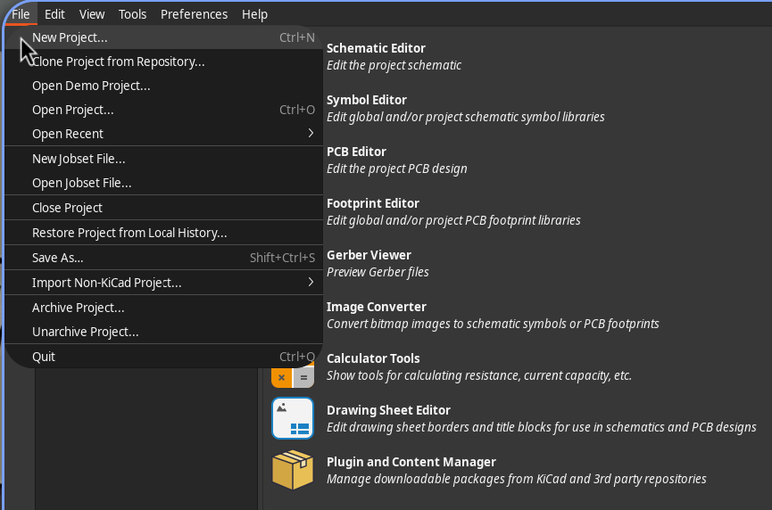

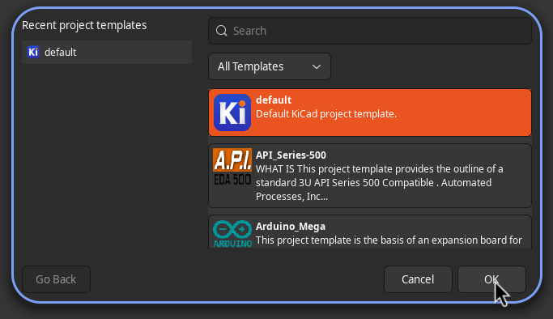

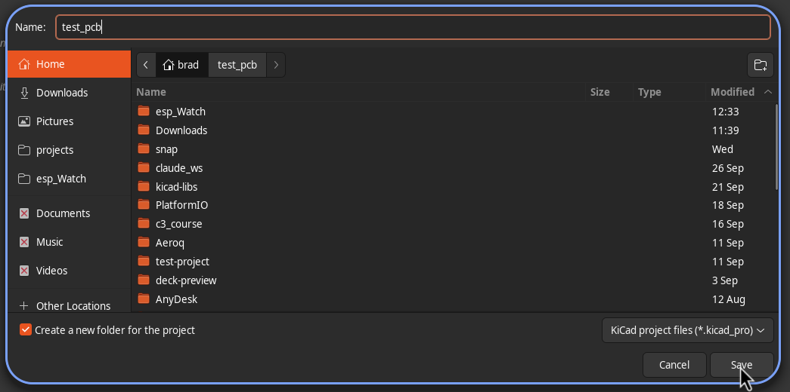

KiCad creates three files with the project's name. You will use all three:

| File | Holds |
|---|---|
| `.kicad_pro` | Project settings |
| `.kicad_sch` | The schematic (this unit) |
| `.kicad_pcb` | The board (C3) |

KiCad 10 also keeps automatic backups in a hidden `.history` folder. Leave it out of Git.

## Step 2: Open the Schematic Editor

Double-click the `.kicad_sch` file in the Project Files list, or click **Schematic Editor** on the right.

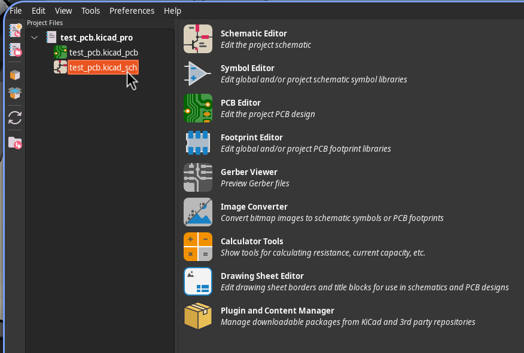

<!-- Claude to add numbered callouts: 1 top toolbar, 2 left toolbar (display), 3 right toolbar (drawing tools), 4 Properties panel, 5 canvas with the sheet, 6 status bar (grid and units) -->
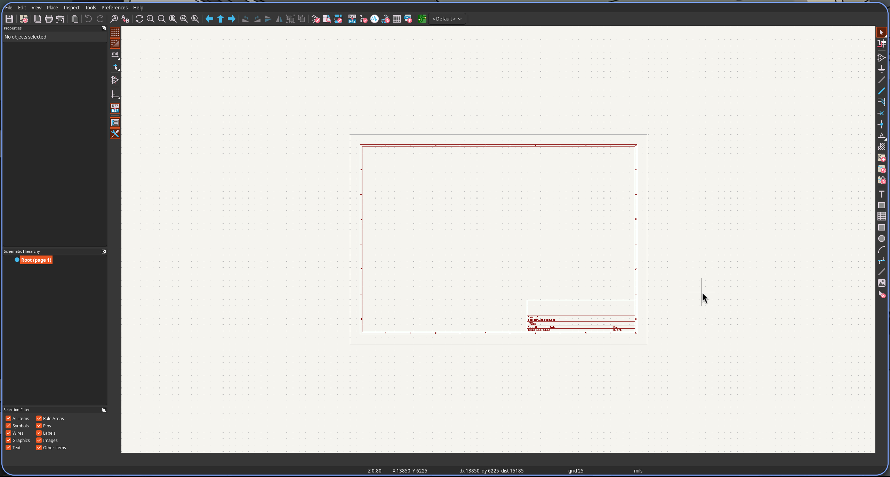

The **right toolbar** holds the drawing tools. The **left toolbar** holds display settings such as the grid and units. The **top toolbar** holds the checks (annotate, ERC, footprints).

**Moving around:** drag with the middle or right mouse button to pan, and use the scroll wheel to zoom. On a laptop touchpad, change this in **Preferences → Preferences → Mouse and Touchpad** [1]. **Help → List Hotkeys** shows every shortcut.

## Step 3: Set Up the Sheet

Right-click an empty spot on the sheet and choose **Properties…** (**E**), or use **File → Page Settings**.

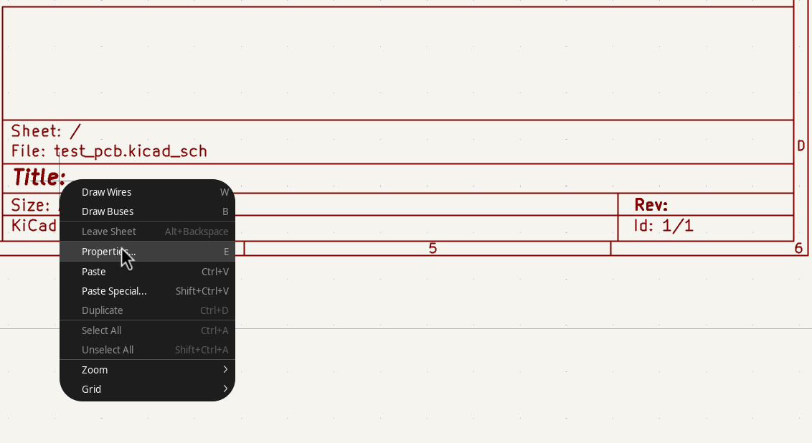

Fill in the title, date and revision, and choose the paper size. These print in the title block in the bottom-right corner, and they tell anyone holding a printout which version it is.

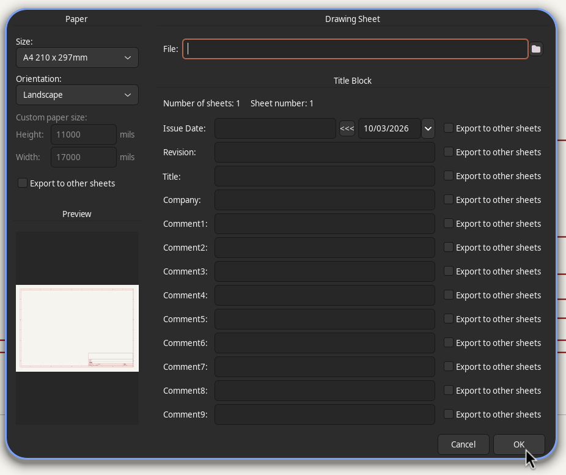

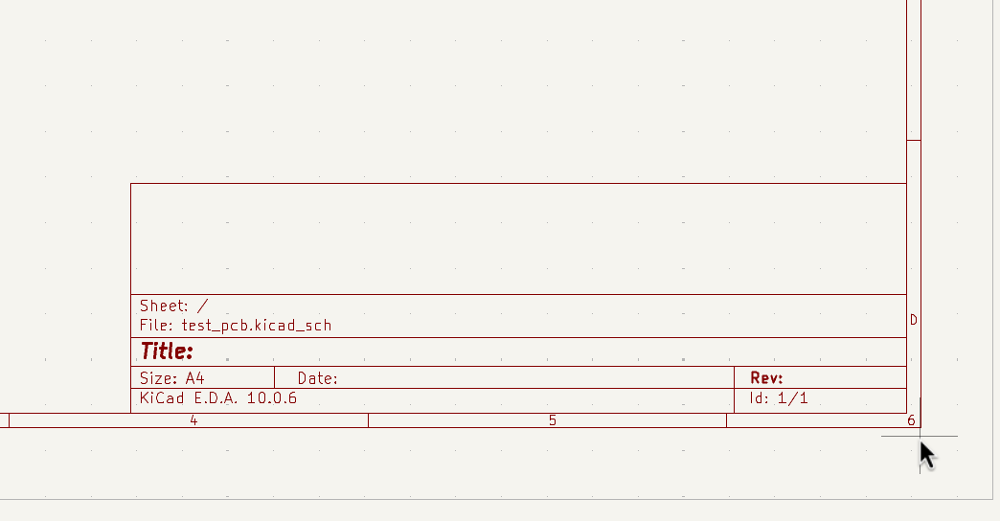

<!-- REFPRODUCT:START -->
esp_watch uses A4, title `ESP_WATCH`, revision `0.1.0`. Raise the revision every time a version goes to the fab house.
<!-- REFPRODUCT:END -->

## Step 4: Place the Symbols (A)

Press **A**, or click the **Place Symbols** button in the right toolbar.

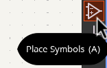

The **Choose Symbol** dialog opens. Type in the search box, pick the symbol, click **OK**, then click on the sheet to place it.

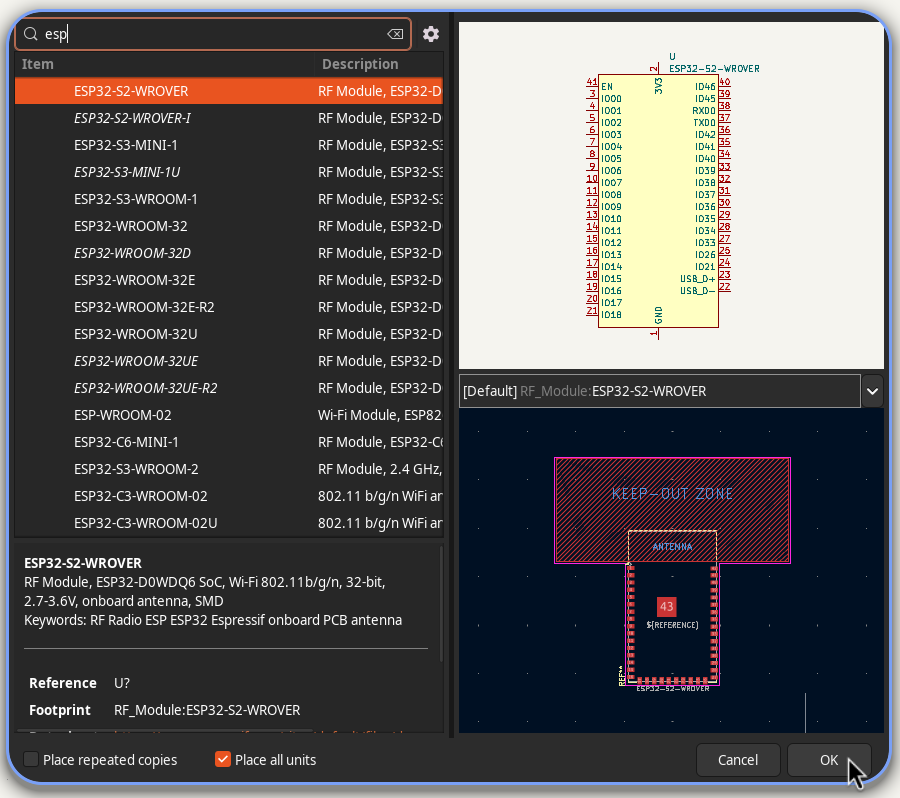

KiCad's libraries hold the chips and generic parts: `SW_Push` for a pushbutton, `R` for a resistor, `Conn_01x04` for a 4-pin header. Most **modules** are not there, because each seller makes a slightly different board. esp_watch's three modules use symbols the author drew, kept in a project library (`symbol.kicad_sym`). [C2](C2-symbols-and-footprints.md) shows how to draw one. Until you have, you can place a generic connector with the right pin count as a stand-in.

Once a symbol is on the sheet, these keys arrange it:

| Key | Does |
|---|---|
| **M** | Move. The item comes away from its wires, which stay where they were. |
| **G** | Drag. The wires stay attached and stretch to follow. Dragging a selected item with the mouse does the same. |
| **R** | Rotate |
| **X** / **Y** | Mirror |
| **Del** | Delete |
| **Esc** | Cancel the current tool |

Put the microcontroller in the middle, and each module on the side where its pins face the microcontroller. A schematic arranged this way needs few crossing wires.

## Step 5: Add Power Symbols (P)

Press **P**, or click the **Place Power Symbols** button.

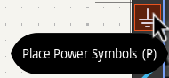

The dialog now shows only power symbols. Place `+3V3` and `GND` wherever a pin needs them.

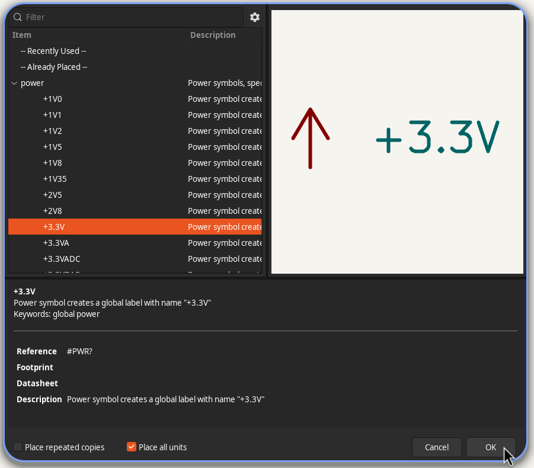

**Power symbols with the same name are connected,** even with no wire between them [1]. Every `GND` on the sheet is one net. This keeps the drawing clean: each module gets its own small `+3V3` and `GND` symbol instead of long supply wires.

## Step 6: Draw the Wires (W)

Press **W**, or click the **Draw Wires** button.

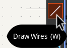

Click a pin to start the wire, and click another pin to finish it. To go round a corner, **click once while drawing**: the wire up to that point is fixed, and you carry on left, right, up or down from there. Double-click to end a wire in empty space, and press **Esc** to cancel. Hovering over an unconnected pin also starts a wire when you click it.

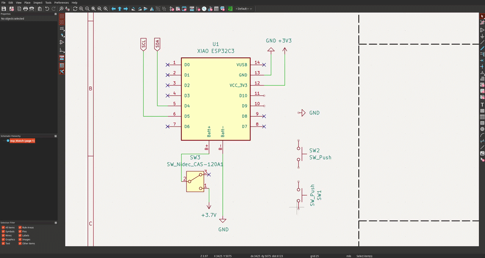

The small circle on a pin disappears once it is connected. Where a wire meets the middle of another wire, KiCad adds a **junction** dot automatically. If two wires cross without a dot, they are **not** connected. Press **J** (**Place Junctions**) to add one by hand only when KiCad has not.

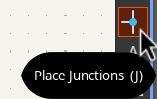

## Step 7: Name the Signals with Net Labels (L)

Press **L**, or click **Place Net Labels**.

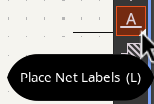

The **Label Properties** dialog opens first. Type the net's name in **Label** and click **OK**. A label needs a name: the name is what makes the connection. To place several labels in a row, tick **Multiple label input** and type one name per line.

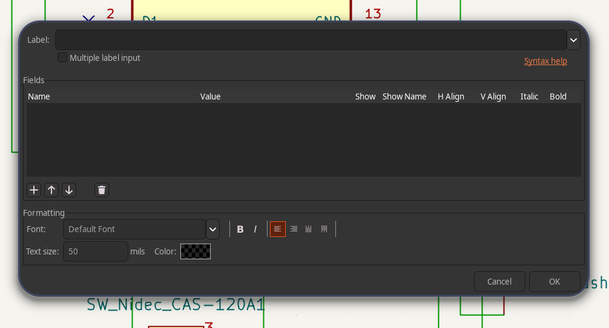

The label now follows the cursor. Click to drop it so its small connection point sits **on a wire**. A label floating next to a wire connects nothing.

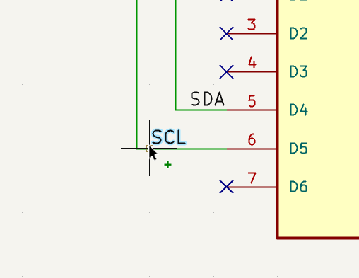

**Labels with the same name are connected** [1], so `SDA` on the microcontroller and `SDA` on each module form one net, with no wire running between them.

Take every name from your **B2 interface table**, and spell it the same way in the schematic, the PCB and the firmware. The names follow the net onto the board, where they appear on every pad.

A name must match **exactly**. `SDA` and `I2C_SDA` are two different nets, and nothing joins them. After labelling, click the **Highlight Nets** tool and click a wire: every pin on that net lights up, which is a quick way to check.

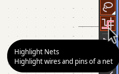

<!-- REFPRODUCT:START -->
esp_watch labels only `SDA` and `SCL`, and wires its buttons directly. It uses **global labels** for them: the flag-shaped labels at the end of each module's SDA and SCL wire and at the XIAO's D4 and D5. On one sheet a global label behaves exactly like a net label. On your own board, label every signal from the interface table, such as `BTN_NEXT` and `BTN_PREV`, so the PCB editor shows readable names instead of `Net-(U1-D10)`.
<!-- REFPRODUCT:END -->

A one-sheet board needs only **net labels** (**L**). **Global labels** (**Ctrl+L**) connect across several sheets of a larger design; their dialog adds a **Shape** (input, output, bidirectional) that ERC can check. Either works on one sheet. Pick one kind and use it for every net, so the drawing reads the same everywhere.

## Step 8: Mark the Unused Pins (Q)

Press **Q**, or click **Place No Connect Flags**, and click each pin that is unused on purpose. The **no-connect flag** (a small ✕) tells ERC that the pin is meant to be left alone [1].

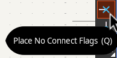

<!-- REFPRODUCT:START -->
esp_watch has 16: eight on the XIAO (D0–D3, D6–D8 and VUSB), the module pins it does not use, such as both sensors' interrupt pins (the firmware polls the sensors instead), and the slide switch's spare pin.
<!-- REFPRODUCT:END -->

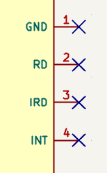

Do not delete an unused pin from a symbol, and do not change its type to hide it. The flag records a decision; the other two hide one.

## Step 9: Fill In Each Symbol's Fields (E)

Click a symbol to select it; it is highlighted, as below. Then press **E**, or double-click it.

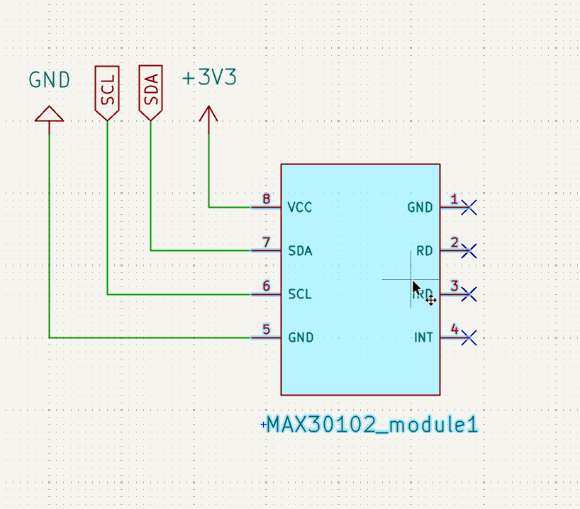

The **Symbol Properties** dialog has four fields that matter:

| Field | Put in it | Why |
|---|---|---|
| **Reference** | `U1`, `U2`, `SW1`, `R1` | The short name on the board's silkscreen and in the BOM |
| **Value** | The part: `XIAO ESP32C3`, `MAX30102 module, black`, `4.7k` | Becomes the BOM's description |
| **Footprint** | The pad pattern on the board | Links the symbol to copper (Step 11) |
| **Datasheet** | A link to the datasheet | One click from the schematic to the source |

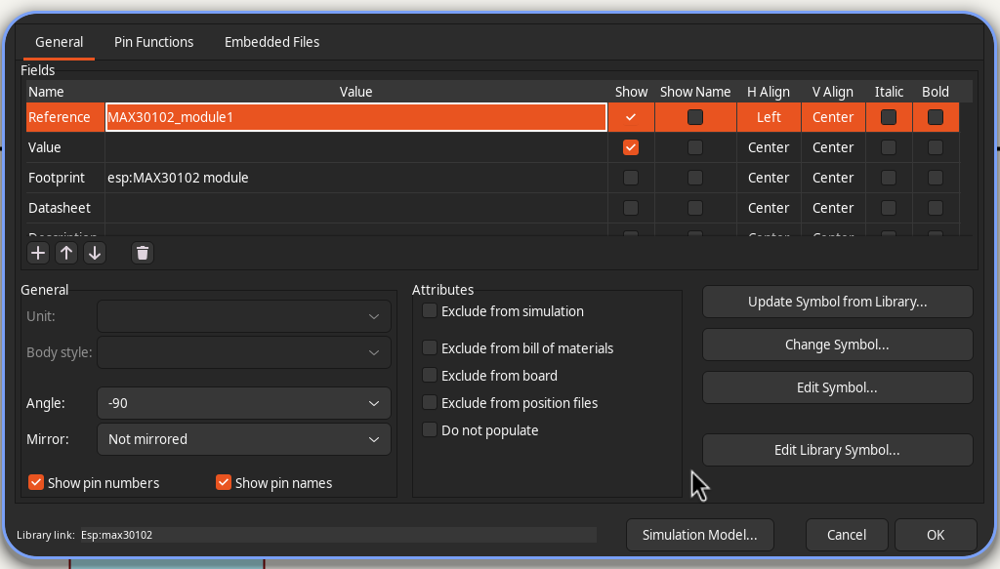

<!-- REFPRODUCT:START -->
esp_watch's three module symbols carry long references (`MAX30102_module1`, `MPU-6050_module1`, `SSD1306OLED1`) and empty Value fields. On your board, use the standard short prefix (`U` for a module or IC) and put the part name in Value, so the BOM in F0 reads cleanly.
<!-- REFPRODUCT:END -->

## Step 10: Annotate

Every symbol needs a unique reference. KiCad fills them in as you place symbols, as long as **Annotate Automatically** in the left toolbar is on.

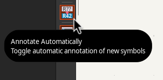

After copying and pasting, you may see `U?` or two parts with the same reference. Click **Annotate Schematic** in the top toolbar, keep the defaults, and click **Annotate**.

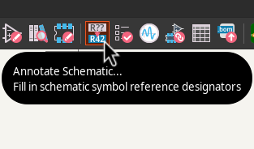

<!-- MEDIA
type: screenshot
id: C1-W11
caption: The Annotate Schematic dialog
brief: KiCad 10, esp_watch's schematic. Click the Annotate Schematic button in the top
  toolbar (the icon showing "R??" above "R42"; Tools → Annotate Schematic also opens it).
  Capture the dialog that opens, with its default options (scope, order, numbering) and
  the Annotate button visible. Crop to the dialog. Do not press Annotate on the real project.
-->

## Step 11: Assign Footprints

Each symbol needs a **footprint**: the pattern of copper pads its part is soldered to. Click **Assign Footprints** in the top toolbar.

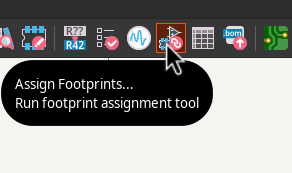

The window has three panes:

| Pane | Shows | You |
|---|---|---|
| **Left** | Footprint libraries, such as `Button_Switch_THT` for through-hole switches and `..._SMD` libraries for surface-mount parts | Click a library to list its footprints on the right |
| **Middle** | Every symbol on the sheet: reference, value and the footprint assigned so far | Click the symbol you are assigning |
| **Right** | The footprints in the chosen library | Double-click one to assign it to the selected symbol |

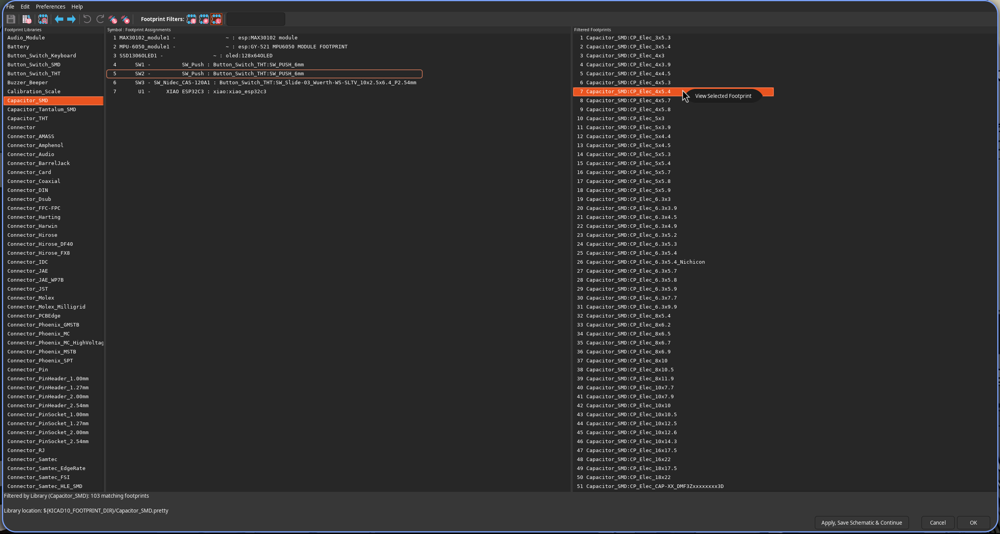

Before you double-click, check the footprint. Right-click it and choose **View Selected Footprint** to see its pads and size [5]. Compare them with the part's datasheet, and check that the part you will buy matches that size. The **Footprint Filters** buttons at the top narrow the right pane, for example to footprints with the symbol's pin count; type in the box beside them to narrow it further.

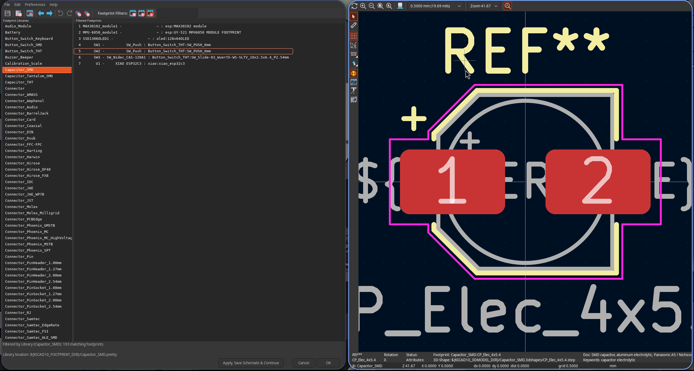

Click **Apply, Save Schematic & Continue** to keep going, or **OK** when every symbol has a footprint.

<!-- REFPRODUCT:START -->
esp_watch's assignments:

| Symbol | Footprint |
|---|---|
| U1, XIAO ESP32-C3 | `xiao:xiao_esp32c3` (downloaded) |
| MAX30102 module | `esp:MAX30102 module` (drawn by the author) |
| MPU-6050 module | `esp:GY-521 MPU6050 MODULE FOOTPRINT` |
| SSD1306 OLED | `oled:128x64OLED` |
| SW1, SW2 | `Button_Switch_THT:SW_PUSH_6mm` (KiCad library) |
| SW3 | `Button_Switch_THT:SW_Slide-03_Wuerth-WS-SLTV_10x2.5x6.4_P2.54mm` (KiCad library) |
<!-- REFPRODUCT:END -->

Where the library has no footprint for your part, assign it later: drawing and checking one is C2's job. Before C3, every symbol must have a footprint.

## Step 12: Run ERC

Click **Electrical Rules Checker** in the top toolbar (or **Inspect → Electrical Rules Checker**), then **Run ERC**.

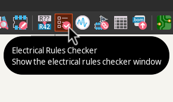

Each problem is listed in the dialog, and an arrow marks it on the sheet. Click a line to jump to its arrow [5].

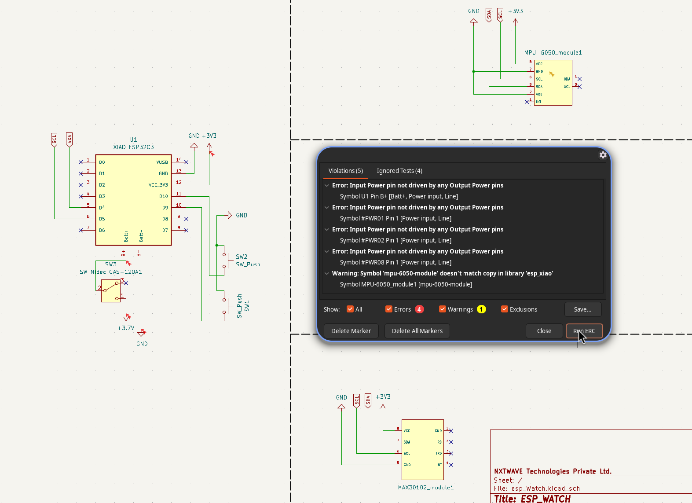

ERC knows each pin's **type** (power input, output, bidirectional and so on), set in the symbol, and checks that connected pins make sense together. It also catches unconnected pins, unannotated symbols and labels that connect to nothing. These are the errors you will meet:

| ERC message (paraphrased) | Usual cause | Fix |
|---|---|---|
| Input power pin not driven by any output power pin | Power arrives through a pin KiCad does not see as a source: a battery, a connector, or a module's own regulator | Confirm the net really is powered, then place a **PWR_FLAG** (from the power library) on it [5] |
| Pin not connected | A pin with no wire and no flag | Wire it, or add a no-connect flag if it is unused on purpose |
| Symbol not annotated | `U?` left after copying | Annotate (Step 10) |
| Label not connected | A typo, or a label not touching its wire | Fix the spelling or the position |
| Two outputs connected | Two pins that both drive the net | Check the design, and each pin's type in the symbol (C2) |
| Symbol doesn't match copy in library (warning) | The symbol in the schematic differs from the one in its library, often because the library was edited afterwards | Right-click the symbol, **Update Symbol from Library**, if the library version is the right one |

<!-- REFPRODUCT:START -->
Run on esp_watch with every test on, ERC shows four errors and one warning. All four errors are "Input Power pin not driven": on the XIAO's `B+` pin and on three power symbols. The XIAO's own regulator makes the 3.3 V and the battery feeds `+3.7V`, but the symbols type those pins as power **inputs**, and nothing on the sheet is typed as a power **output**, so ERC sees no source. The warning says the MPU-6050 symbol no longer matches its library copy.

The circuit is fine. The author checked by hand that the 3.3 V and battery nets never touch each other or GND, then set ERC to ignore those two tests. The clean result below lists them under **Ignored Tests**.
<!-- REFPRODUCT:END -->

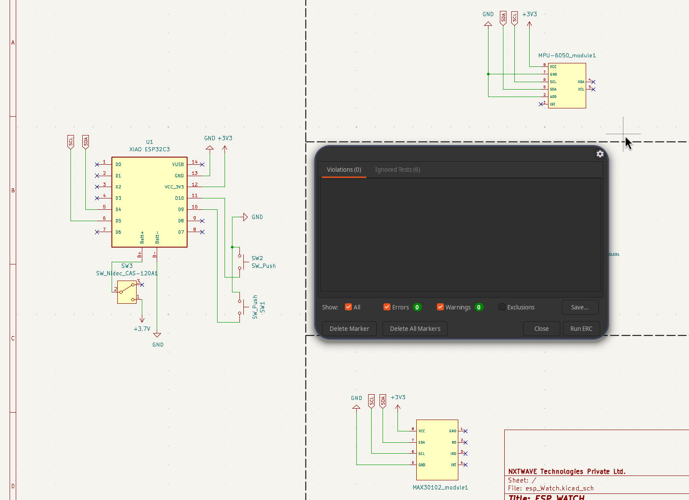

There are two honest ways out of a power-input error:

1. **Place a PWR_FLAG** (from the power symbols, **P**) on each net that really is powered. It tells ERC the net has a source, and every other check keeps working. This is the better fix, and the one to use on any board bigger than a few modules.
2. **Ignore the test**, as esp_watch does: right-click the error and choose to ignore that kind of violation. Do it only after checking by hand that each supply reaches the pins it should, that no two different voltages are joined, and that no supply touches GND. Write that check down.

Aim for **zero errors**. You may exclude a single violation by right-clicking it, but write down why. Never change pin types to make errors go away: the errors disappear, and so does every check ERC could have made.

**ERC does not know what your circuit is for.** A schematic can pass with SDA and SCL swapped, or a button on a boot pin. That is why you tick each connection against the B3 pin map as you draw.

## Step 13: Notes, and the BOM

**Fabrication notes.** Add text (the **T** tool) for anything a builder must know that the wiring cannot show.

<!-- REFPRODUCT:START -->
esp_watch's schematic carries no notes. One fact from B3 is invisible in its wiring and deserves one: `MAX30102_module1` must be the **black** (3.3 V) module, because the green one pulls the bus to 1.8 V.
<!-- REFPRODUCT:END -->

**Test points** are small pads where a probe can touch during bring-up. Add one (symbol `TestPoint`) on each power rail, ground and each bus line if the board has room.

**BOM.** **Tools → Generate Bill of Materials** lists every symbol's reference, value and footprint [5]. This list is the starting point for the costed BOM in F0, which is why the Value fields matter.

## Tool Reference

The tools this unit used, as they appear in KiCad 10. Hover over any button in KiCad to see its name and hotkey.

| Tool | Key | Use it to |
|---|---|---|
|  | A | Place a part |
|  | P | Place `+3V3`, `GND`, `PWR_FLAG` |
|  | W | Connect two pins |
|  | L | Name a net; same names connect |
|  | Q | Mark a pin unused on purpose |
|  | J | Join wires where KiCad did not |
|  | — | Light up every pin on one net |
|  | — | Give every symbol a unique reference |
|  | — | Link symbols to pad patterns |
|  | — | Check the drawing for errors |
| 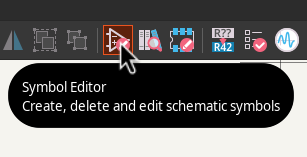 | — | Draw your own symbol (C2) |
| 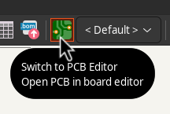 | — | Open the board (C3) |

---

## Applying What You Have Learned

Draw your own product's schematic, following the steps above.

1. **Create the project** and fill in the page settings, with revision `0.1`. Put the project folder in a Git repository.
2. **Place every part** from your B4 BOM. For a module with no symbol, use a generic connector with the right pin count, or draw one now with C2.
3. **Wire and label** every connection in your B2 interface table, ticking each one off. Use the table's names for the labels.
4. **Flag every unused pin** with a no-connect flag.
5. **Fill in Reference, Value and Footprint** for every symbol, then annotate. Leave a footprint blank only if C2 will draw it, and note which.
6. **Run ERC to zero errors.** Write a reason beside every exclusion.
7. **Add one fabrication note** for anything a builder could get wrong, and generate the BOM.

**Deliverable:** your KiCad project (`.kicad_pro` and `.kicad_sch`), a screenshot of the clean ERC result, and the generated BOM, saved in your design pack as `C1-schematic/`.

## Self-Check

Open your schematic and answer each item Y or N.

1. The title block shows the product name, a date and a revision. — Y/N
2. Every connection in your B2 interface table appears in the schematic, and each was ticked off. — Y/N
3. Every signal net has a label whose name matches the interface table exactly. — Y/N
4. Every unused pin has a no-connect flag. — Y/N
5. No reference ends in `?`, and no two symbols share a reference. — Y/N
6. Every symbol has a Value, and every symbol has a footprint (or a note saying C2 will draw it). — Y/N
7. ERC reports zero errors, and every exclusion has a written reason. — Y/N
8. The project folder is committed to a Git repository. — Y/N

---

## Check Your Understanding

**1.** You label the microcontroller's data pin `SDA` and the sensor's data pin `I2C_SDA`. What happens?

- A. KiCad joins them, because both names contain "SDA".
- B. ERC changes one name to match the other.
- C. They stay two separate nets.
- D. They connect on the PCB but not in the schematic.

Answer

**C.** Labels connect only when their names match exactly. **A** and **B** describe matching that KiCad does not do. **D** is impossible: the PCB's nets come from the schematic. Highlight Nets shows the problem at once.

**2.** A pushbutton already has wires to two pins. You want to move it a little to the left and keep it connected. Which key do you use?

- A. M
- B. G
- C. R
- D. X

Answer

**B.** Drag (G) moves the symbol and keeps its wires attached. **A**, move, leaves the wires behind, so the pins come loose. **C** rotates and **D** mirrors; neither moves the part.

**3.** Your board is powered from a USB connector symbol whose pins are all passive. ERC reports "Input power pin not driven" on `+5V`. You have checked that the connector really does supply `+5V`. What is the right fix?

- A. Change every module's power pin type to passive.
- B. Exclude the error without a note.
- C. Delete the `+5V` power symbols and use wires instead.
- D. Place a PWR_FLAG on the `+5V` net.

Answer

**D.** A PWR_FLAG tells ERC the net is driven, which is true. **A** removes information, so ERC can no longer catch a real unpowered part. **B** leaves an unexplained exclusion. **C** changes nothing about what drives the net.

**4.** Your microcontroller's pin D7 is unused. What should the schematic show?

- A. A no-connect flag on D7.
- B. D7 deleted from the symbol.
- C. D7's type changed to passive.
- D. A wire from D7 to ground.

Answer

**A.** The flag records that the pin is unused on purpose, and ERC accepts it. **B** makes the symbol disagree with the real part. **C** hides the pin from ERC instead of recording a decision. **D** ties an I/O pin to ground, which could short it if the firmware ever drives it high.

**5.** A schematic passes ERC with zero errors. Which of these could it still contain?

- A. A symbol with reference `U?`
- B. SDA and SCL swapped at one sensor
- C. A pin with no wire and no flag
- D. A label touching no wire

Answer

**B.** Both nets connect pins of sensible types, so ERC sees nothing wrong. Only checking against your pin map catches it. **A**, **C** and **D** are all things ERC reports.

**6.** You select an 8-pin module symbol in Assign Footprints, and the right pane lists thousands of footprints. What narrows it fastest?

- A. Scrolling the right pane until the module's footprint appears.
- B. Deleting unused libraries from the left pane.
- C. Re-annotating the schematic.
- D. The pin-count filter, then the text box.

Answer

**D.** The pin-count filter keeps only 8-pad footprints, and the text box narrows those further. **A** works but wastes time. **B** changes your library setup for every project. **C** has nothing to do with footprints.

**7.** After copying a sensor section and pasting it, ERC reports two symbols named `U3`. What do you do?

- A. Run Annotate Schematic.
- B. Delete one of the sensors.
- C. Exclude the error.
- D. Rename the net labels.

Answer

**A.** Annotation gives every symbol a unique reference. **B** removes a part you need. **C** would leave two parts with the same reference, which confuses the BOM and the board. **D** changes nets, not references.

**8.** Your OLED module is sold in two versions: one with pin 1 as GND, one with pin 1 as VCC. Your footprint suits the GND-first version. Which fabrication note prevents a failure?

- A. "The display address is 0x3C."
- B. "Connect the OLED's supply pin to the 3.3 V rail, never to 5 V."
- C. "Fit only the GND-first OLED version."
- D. "All grounds are common."

Answer

**C.** The pin order is invisible in the schematic, but fitting the wrong version reverses the supply. **A** and **D** are true but cannot be got wrong by a builder. **B** is already shown by the wiring.

---

## What Comes Next

Some of your parts have no symbol or footprint in KiCad's libraries. In [C2](C2-symbols-and-footprints.md) you draw them, and check the ones you download.

---

## References

1. KiCad. *Getting Started in KiCad, version 10.0* (new project, schematic editor basics, placing symbols, wiring, labels, annotation, footprint assignment, ERC). https://docs.kicad.org/10.0/en/getting_started_in_kicad/getting_started_in_kicad.html
2. KiCad. *PCB Editor reference manual, version 10.0*. https://docs.kicad.org/10.0/en/pcbnew/pcbnew.html
3. KiCad. *Download*. https://www.kicad.org/download/
4. niat-physicalai. *esp_watch* (KiCad project in `pcb/esp_Watch/`). https://github.com/niat-physicalai/esp_watch
5. KiCad. *Schematic Editor reference manual, version 10.0* (no-connect flags, PWR_FLAG, Assign Footprints, ERC, Generate Bill of Materials). https://docs.kicad.org/10.0/en/eeschema/eeschema.html
