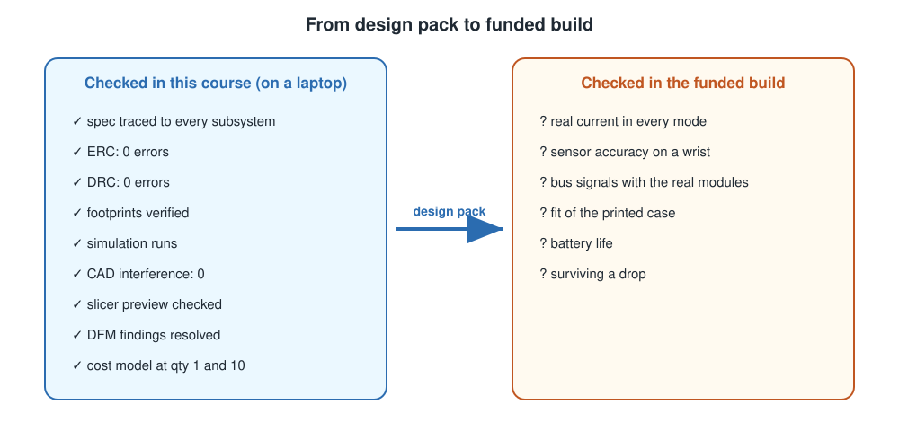

# G — Capstone: The Design Pack and the Reference Review
## Turning Thirty Deliverables into One Proposal Someone Can Fund

**Course:** C3 — From Problem Statement to Manufacturable Design
**Module:** 7 — Capstone
**Time:** ~2 hours, plus your own pace · **You will produce:** a complete Design Pack, a self-review against the rubric, a comparison with the reference watch, and a one-page "what I would change in version 2"

---

### This Pack Is Your Proposal

**This Design Pack is exactly what you submit when you apply for the funded build.** A reviewer will open one folder, read one README, and ask three questions: *Is this a real problem? Is the design complete enough to build? Does this person know where the risks are?* This unit turns your work into a pack that answers all three quickly, checks it against a rubric, and ends with the most honest section of all: a comparison with the reference watch, including where your design is better.

### What You Will Be Able to Do After This Reading

- **Assemble** every deliverable from the course into a single, navigable Design Pack.
- **Review** your pack against a binary rubric, and **fix** what fails.
- **Compare** your design with the reference watch, and **justify** every divergence.
- **Write** a one-page version 2 plan that names your design's real risks.

---

# Part 1 — Assembling the Pack

## What Goes In

The Design Pack has nine sections. Every one is something you have already made:

| # | Section | Contents | From |
|---|---|---|---|
| 1 | Specification and system architecture | Spec, context diagram, subsystem breakdown, allocation table, state diagram, failure table, decision notes | A0, A1, A2 |
| 2 | Hardware architecture | Block diagram, interface table, power tree, current budget, pin map | B2, B3 |
| 3 | Part selection | Sensor selection matrix, interface choice table, module-versus-IC table, costed BOM with lifecycle | B0, B1, B4, F0 |
| 4 | Schematic and PCB | KiCad project (ERC and DRC clean), your own symbols and footprints, footprint checklist | C1, C2, C3 |
| 5 | Firmware design | Architecture diagram, module table, flowchart, state diagram, sleep-mode choice | D0, D1, D2 |
| 6 | Firmware and simulation | Firmware repository with README, serial protocol doc, payload contract, working simulation link | D0–D5, B5 |
| 7 | Mechanical | Concept sketches, CAD assembly, board STEP, material choice, presentation image, hardware list, sliced enclosure file, DFM audit, functional design notes | C0, E0–E5 |
| 8 | Manufacturing | Fabrication zip with annotation, DFM reports, cost model at 1 and 10 units | F1, F2 |
| 9 | Version 2 | One page: what you would change and why | This unit |

## A Structure a Reviewer Can Navigate

Use numbered folders matching the sections, so the order is obvious:

```text
design-pack/
├── README.md                  ← start here
├── 01-spec-and-architecture/
├── 02-hardware-architecture/
├── 03-part-selection/
├── 04-schematic-and-pcb/
├── 05-firmware-design/
├── 06-firmware-and-simulation/
├── 07-mechanical/
├── 08-manufacturing/
├── 09-version-2.md
├── rubric-review.md           ← the rubric, answered Y/N
├── reference-review.md        ← converge / diverge / justify
└── verification-log.md        ← every check you ran, its date and result
```

Keep every file in a format a reviewer can open without your tools: diagrams as images or Mermaid text, spreadsheets as `.xlsx` or `.csv`, KiCad and CAD files alongside PDF or image exports of the key views.

## The README: One Page That Explains the Rest

The README is the first thing a reviewer reads, and often the only thing they read carefully. Keep it to one page:

```markdown
# <Product name> — Design Pack v1.0

## The problem
Two sentences, from your Part 2 problem statement.

## The product
Three sentences: what it is, who wears or uses it, what it does.
One image: the coloured CAD model with the board inside.

## Key numbers
| Battery life (usage pattern UP-1) | Size (W × L × H) | Unit cost at 1 / 10 |
|---|---|---|

## Status of every check
| Check | Result | Where |
|---|---|---|
| ERC | 0 errors | 04-schematic-and-pcb/ |
| DRC | 0 errors, N accepted warnings | 04-schematic-and-pcb/ |
| Interference | 0 overlaps | 07-mechanical/ |
| Fab DFM | resolved | 08-manufacturing/ |
| Simulation | link | 06-firmware-and-simulation/ |

## Top three risks
1. ...
2. ...
3. ...

## How to read this pack
One line per folder.
```

The "top three risks" section matters more than it looks. A reviewer who sees you have named your own risks trusts the rest of the pack more, not less.

## The Verification Log

In the verification stack page at the start of the course, you were asked to record every check: what, when and the result. Gather those records into one `verification-log.md`. For each row, include what the check did **not** cover, as B5 taught for simulations. It is the evidence that your design has been checked by something other than your own confidence.

<!-- MEDIA
type: screenshot
id: G-01
caption: A well-organised Design Pack: numbered folders and a one-page README
brief: A file browser (or GitHub repository view) showing a design-pack folder with the
  numbered subfolders 01 to 08, README.md, 09-version-2.md and verification-log.md. Beside
  it, the README rendered: a title, a two-sentence problem, a CAD image thumbnail of a
  small wrist device, a key-numbers table and a status-of-checks table with green ticks.
  Clean, readable, no personal details.
-->

---

# Part 2 — Reviewing It Yourself

## The Rubric

There is no instructor to mark your pack, so you review it yourself, with a rubric of yes-or-no items that can each be checked by opening a file. Work through it honestly. Every "no" is either fixed or written down as a known gap in the README.

| Section | Rubric item | Y/N |
|---|---|---|
| **Spec** | Every requirement has an ID, a number, a condition and a check method | |
| | The battery requirement names a usage pattern | |
| | An out-of-scope list exists, with reasons | |
| **Architecture** | Every requirement has exactly one owner in the allocation table | |
| | The state diagram has no traps, and every event is handled in every state | |
| | At least two decision notes exist, each with options, a reason and a cost | |
| **Hardware** | Every connection in the block diagram has a row in the interface table | |
| | The current budget gives a runtime that meets the spec, with sources | |
| | No strapping pin is held at the wrong level at reset | |
| **Parts** | Every active part has an MPN, a second source and a lifecycle status | |
| | Every sensor choice names a rejected alternative | |
| **Schematic and PCB** | ERC: zero errors | |
| | DRC: zero errors, and every accepted warning has a reason | |
| | Every footprint has its four measurements recorded | |
| **Firmware** | No blocking calls in the main loop | |
| | Code transitions match the state diagram, arrow for arrow | |
| | Every external dependency has a timeout and a failure path | |
| | A simulation link runs without errors | |
| **Mechanical** | Interference check: zero overlaps | |
| | The sensor, if any, reaches the skin in a section view | |
| | The enclosure is sliced, with a time and material estimate | |
| **Manufacturing** | The fabrication zip is annotated file by file | |
| | Unit cost is given at 1 and 10, with sources | |
| **Pack** | The README fits on one page and names three risks | |
| | Every check in the README links to its evidence | |

> **Teaching model.** A rubric of binary items cannot tell you whether a design is *good*. It tells you whether it is *complete* and *checked*. Good judgement shows up in the comparison and the version 2 page, which is where the next two parts come in.

---

# Part 3 — The Reference Review

## Comparing With the Reference Watch

Throughout the course, the reference watch, esp_watch, has been used as a worked example, including the places where it got things wrong. Now compare your design with it deliberately, section by section.

For every section, answer three questions:

1. **Where did you converge?** You made the same choice. Was it for the same reason?
2. **Where did you diverge?** You made a different choice.
3. **Can you justify each divergence?** Either your product's requirements are different, or your choice is better, or you have learned something.

### Worked Example: Three Rows of a Reference Review

<!-- REFPRODUCT:START -->
A student's product is a hostel activity tracker with semester history. Their reference review includes:

| Topic | esp_watch | My design | Converge / diverge | Justification |
|---|---|---|---|---|
| Connectivity | WiFi once at first boot, then off (A2 decision note) | BLE to a phone app | Diverge | My spec requires semester history (FR-05), which A1 showed esp_watch cannot deliver; BLE sends small daily summaries at low radio power, and the phone stores the history |
| Motion sensor | MPU-6050, obsolete, clone on the module | MPU-6050 module for the prototype, behind a `MotionSensor` interface | Converge, with a plan | Same reason as esp_watch: cheap and available now. Unlike esp_watch, my BOM records it as obsolete, and my firmware isolates it in one driver, so the v2 swap is a driver change |

And one row where the student found they could *not* justify a divergence:

| Topic | esp_watch | My design | Converge / diverge | Justification |
|---|---|---|---|---|
| Second button | D9, which already carries the XIAO's BOOT button | D8 | Diverge | **Cannot justify.** D8 is a strapping pin, and nothing on my board holds it high at reset (B3). Moved the button to D3, which has no start-up role. |
<!-- REFPRODUCT:END -->

**Check.** Row 1 justifies a divergence with a requirement. Row 2 converges but handles the risk better. Row 3 found a mistake and fixed it. The only bad outcome is a divergence left unexamined.

## Where the Reference Is Weak, Say So

esp_watch is the course author's own design, with known issues. Criticise it wherever your design does better.

<!-- REFPRODUCT:START -->
These are the reference watch's recorded weak points, all of which appeared in earlier units:

- **Thickness.** The board with its parts is 14.044 mm tall, because the display sits on a female header above the motion sensor (E2).
- **An obsolete motion sensor**, a clone on its module, kept for version 1 (F0).
- **A lid held by an interference fit**, sensitive to print accuracy and loosening with use (E3).
- **Measured on a breadboard, modelled on paper.** Its bus measurements come from the breadboard prototype, and every current figure is modelled; none was measured (B3).
- **Several design decisions not yet recorded**, such as the sensor window and sweat protection (E4).
<!-- REFPRODUCT:END -->

If your design avoids any of these, say how. If it repeats one, say why that was acceptable for your product.

---

# Part 4 — Version 2, on One Page

The last page of the pack looks forward. It is short, and it is where a reviewer sees whether you understand your own design.

Use this structure:

```markdown
# What I would change in version 2

## Changes forced by risk
Things that must change for the product to survive: an obsolete part, a failure mode
with no detection, a requirement the design only just meets.

## Changes that improve the product
Things that would make it better: thinner, longer battery life, cheaper at volume.

## Things I would test first in the funded build
The gaps your simulations and CAD could not close: what you would measure first
on real hardware, and what result would change the design.
```

For every item, give the reason in one line and trace it to a requirement, a check or a cost.

<!-- REFPRODUCT:START -->
For comparison, a version 2 page for esp_watch, written from its open issues, might include: replacing the obsolete MPU-6050 (TDK names the ICM-42670-P as its recommended alternate), which is a new driver behind the existing interface; rethinking the module stack to reduce thickness, perhaps towards C0's concept C; a repeatable lid fastening in place of the interference fit; and, first on the list for the build, measuring real current in every mode, because every figure so far is modelled.
<!-- REFPRODUCT:END -->

The "test first" section matters most. Your pack has been checked in every way that needs no hardware; the build checks the rest, so say exactly what to measure first.



---

# Putting It All Together

## Applying What You Have Learned

**1. Build the folder structure** in your design pack's Git repository and move every deliverable into its section. Tag the commit whose fabrication files you would send to the fab house ([Version Control](../01-system-architecture/REF-version-control.md), Step 5).

**2. Write the README**, including key numbers, the status of every check and your top three risks.

**3. Compile the verification log** from every check you have run.

**4. Review against the rubric.** Fix every "no" you can; list the rest as known gaps in the README.

**5. Write the reference review**: converge, diverge and justify, for every section.

**6. Write the version 2 page**, with changes forced by risk, improvements, and what to test first.

**Deliverable:** the complete Design Pack folder.

## Self-Check

1. The pack has all nine sections, in numbered folders. — Y/N
2. The README fits on one page. — Y/N
3. The README names three risks. — Y/N
4. Every check in the README links to its evidence. — Y/N
5. The verification log lists every check with its date, result and what it did not cover. — Y/N
6. Every rubric item is answered, and every "no" is fixed or listed as a known gap. — Y/N
7. The reference review covers every section. — Y/N
8. Every divergence has a justification, or is marked "cannot justify" with what you learned. — Y/N
9. The version 2 page has all three parts, each item traced to a requirement, check or cost. — Y/N
10. Every file opens without the tool that made it, or has an exported view beside it. — Y/N
11. The pack is one Git repository on GitHub, and the fab version is tagged with the same revision as the title block and silkscreen. — Y/N

---

## Check Your Understanding

**1.** A reviewer has ten minutes for your Design Pack. What should they read first, and what must it contain?

- A. The KiCad project, because it is the most technical.
- B. The one-page README: the problem, the product, key numbers, the status of every check, and the top three risks.
- C. The firmware source code.
- D. The BOM.

<details>
<summary>Answer</summary>

**B.** The README is the map of the pack, and it tells a reviewer whether the rest is worth their time. **A**, **C** and **D** are important evidence, but each covers only one part of the design.

</details>

**2.** Your design uses a different connectivity route from the reference watch. What makes that divergence convincing?

- A. Saying your choice is more modern.
- B. Tracing it to a requirement the reference does not have, and showing evidence, such as a power calculation, that it works.
- C. Choosing the same route to avoid questions.
- D. Not mentioning it.

<details>
<summary>Answer</summary>

**B.** A requirement plus evidence is a justification. **A** is a preference. **C** avoids the question rather than answering it. **D** leaves a reviewer to wonder.

</details>

**3.** Your rubric review finds that DRC has three unexplained warnings. What should you do?

- A. Delete the rubric item.
- B. Examine each warning; fix it or write the reason it is acceptable, then update the README's check status.
- C. Mark the item "Y" because there are no errors.
- D. Re-run DRC until they disappear.

<details>
<summary>Answer</summary>

**B.** An accepted warning needs a written reason, as C3 taught. **A** and **C** hide the gap. **D** does not change the design, so the warnings will not disappear.

</details>

**4.** Your current budget is modelled, and your battery-life requirement is met with only 10 % margin. Where does this belong in your version 2 page?

- A. Nowhere; the requirement is met.
- B. Under "things I would test first": measure real current in every mode, and state what result would force a bigger cell or lower sleep current.
- C. Under "changes that improve the product", as longer battery life.
- D. Only in the README's key numbers.

Answer: **B.** A modelled figure with thin margin is a risk only hardware can close, so it is tested first. **A** treats a model as a measurement. **C** calls a risk an improvement. **D** reports the number but hides the risk.

- A. To make the page longer.
- B. Because nothing was built in this course, so the first real measurements are where the design's remaining risks are resolved; naming them shows you know where the gaps are.
- C. Because reviewers require a test plan in every proposal.
- D. Because the design will certainly fail.

<details>
<summary>Answer</summary>

**B.** A design checked only on a laptop still has things only hardware can confirm, such as real current and real sensor accuracy. Naming them is a sign of understanding. **A** is not a reason. **C** may be true of some reviewers, but it is not why. **D** is too pessimistic; the point is to find out quickly.

</details>

**5.** In your reference review you find a divergence you cannot justify. What is the best response?

- A. Remove the row.
- B. Mark it "cannot justify", work out what the reference got right, fix your design if needed, and record what you learned.
- C. Change the reference's description to match yours.
- D. Leave it as it is and hope the reviewer does not notice.

<details>
<summary>Answer</summary>

**B.** An honest "cannot justify" followed by a fix is a strong result. **A** and **D** hide it. **C** misrepresents the reference.

</details>

**A design is finished not when it looks right, but when every requirement is traced, every check is recorded, and every remaining risk is named.**

---

## References

This unit draws only on the earlier units of this course and on the reference product's recorded facts. For the sources behind each check, see the reference lists of the units named in the tables above.

